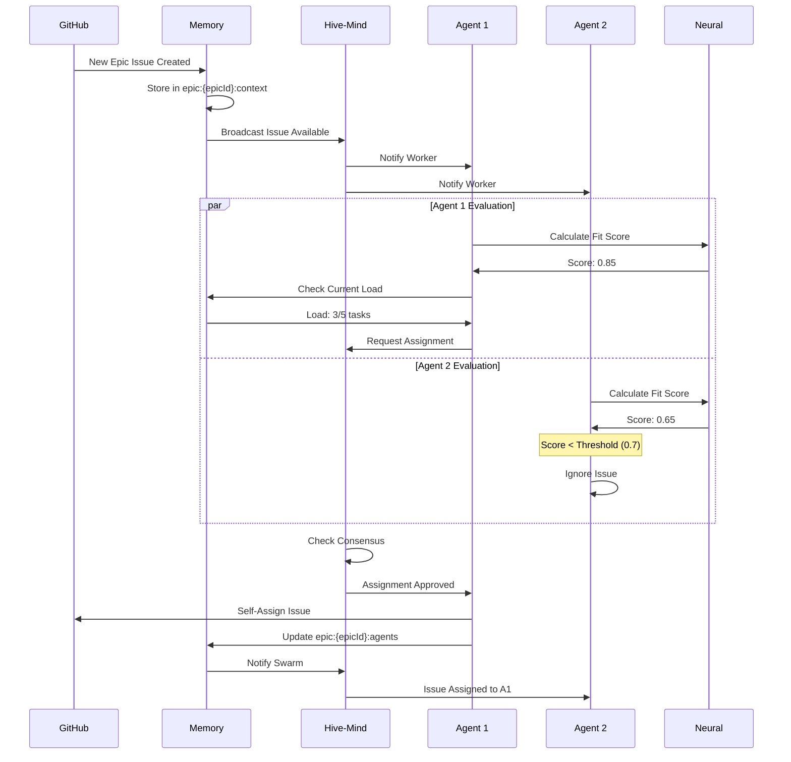

# Teammate-Driven Integration - Visual Diagrams

**Companion to:** [teammate-driven-integration-matrix.md](./teammate-driven-integration-matrix.md)

This document contains visual diagrams for all major integration flows.

---

## System Architecture Diagram

```
┌─────────────────────────────────────────────────────────────────────────────┐
│                        TEAMMATE-DRIVEN AGENT LAYER                          │
│                                                                             │
│  ┌────────────────┐  ┌──────────────┐  ┌─────────────┐  ┌──────────────┐ │
│  │ Epic Context   │  │ Self-        │  │ Peer        │  │ Progress     │ │
│  │ Persistence    │  │ Selection    │  │ Validation  │  │ Tracking     │ │
│  └────────────────┘  └──────────────┘  └─────────────┘  └──────────────┘ │
│                                                                             │
│  ┌────────────────────────────────────────────────────────────────────┐   │
│  │                    GitHub API Integration                          │   │
│  │  • Issues  • Milestones  • PRs  • Comments  • Webhooks           │   │
│  └────────────────────────────────────────────────────────────────────┘   │
└─────────────────────────────────┬───────────────────────────────────────────┘
                                  │
        ┌─────────────────────────┼─────────────────────────┐
        │                         │                          │
┌───────▼────────┐     ┌─────────▼──────────┐    ┌─────────▼──────────┐
│   HIVE-MIND    │     │      MAESTRO       │    │       SPARC        │
│                │     │                     │    │                    │
│ • Queen-Led    │     │ • Specs-Driven     │    │ • Specification    │
│   Coordination │     │   Topology         │    │ • Architecture     │
│ • Consensus    │     │ • Phase Mgmt       │    │ • Refinement       │
│   Mechanisms   │     │ • Living Docs      │    │ • TDD Workflow     │
│ • Collective   │     │ • Steering         │    │ • Completion       │
│   Memory       │     │   Integration      │    │                    │
└───────┬────────┘     └─────────┬──────────┘    └─────────┬──────────┘
        │                        │                          │
        └────────────────────────┼──────────────────────────┘
                                 │
        ┌────────────────────────┼────────────────────────┐
        │                        │                         │
┌───────▼────────┐    ┌─────────▼──────────┐   ┌────────▼──────────┐
│     SWARM      │    │      MEMORY        │   │      HOOKS        │
│                │    │                     │   │                   │
│ • Topology     │    │ • Unified Mgr      │   │ • Pre-Task        │
│   Selection    │    │ • Swarm Memory     │   │ • Post-Task       │
│ • Task Graph   │    │ • AgentDB          │   │ • Post-Edit       │
│ • Agent        │    │   Vector Search    │   │ • Session Mgmt    │
│   Assignment   │    │ • Checkpoints      │   │ • Coordination    │
└───────┬────────┘    └─────────┬──────────┘   └────────┬──────────┘
        │                        │                        │
        └────────────────────────┼────────────────────────┘
                                 │
                      ┌──────────▼──────────┐
                      │       NEURAL        │
                      │                     │
                      │ • Pattern Learning  │
                      │ • Agent Perf Opt   │
                      │ • Duration Predict │
                      │ • Issue Classify   │
                      └─────────────────────┘
```

---

## Epic Lifecycle Flow

```
┌──────────────────────────────────────────────────────────────────────────┐
│ 1. EPIC CREATION                                                         │
└──────────────────────────────────────────────────────────────────────────┘
                                    │
                                    ▼
                          ┌─────────────────┐
                          │  GitHub Epic    │
                          │    Created      │
                          └────────┬────────┘
                                   │
                                   ▼
                    ┌──────────────────────────────┐
                    │  Memory: Store Epic Context  │
                    │  Namespace: epic:{epicId}    │
                    └──────────┬───────────────────┘
                               │
              ┌────────────────┼────────────────┐
              │                │                 │
              ▼                ▼                 ▼
    ┌─────────────┐  ┌─────────────┐  ┌─────────────┐
    │  Maestro:   │  │   SPARC:    │  │   Swarm:    │
    │  Generate   │  │   Create    │  │   Select    │
    │    Spec     │  │   Phase     │  │  Topology   │
    │             │  │  Milestones │  │             │
    └──────┬──────┘  └──────┬──────┘  └──────┬──────┘
           │                │                 │
           └────────────────┼─────────────────┘
                            │
                            ▼
┌──────────────────────────────────────────────────────────────────────────┐
│ 2. AGENT SPAWNING & ASSIGNMENT                                           │
└──────────────────────────────────────────────────────────────────────────┘
                            │
                            ▼
                 ┌──────────────────────┐
                 │  Hive-Mind: Spawn    │
                 │  Workers Based on    │
                 │  Epic Requirements   │
                 └──────────┬───────────┘
                            │
              ┌─────────────┼─────────────┐
              │             │              │
              ▼             ▼              ▼
       ┌──────────┐  ┌──────────┐  ┌──────────┐
       │ Worker 1 │  │ Worker 2 │  │ Worker 3 │
       │ (Coder)  │  │ (Tester) │  │ (Review) │
       └────┬─────┘  └────┬─────┘  └────┬─────┘
            │             │              │
            └─────────────┼──────────────┘
                          │
                          ▼
              ┌───────────────────────┐
              │  Agents Evaluate      │
              │  Epic Issues          │
              │  (Fit Score > 0.7)   │
              └───────────┬───────────┘
                          │
                          ▼
              ┌───────────────────────┐
              │  Self-Select Issues   │
              │  Based on Capability  │
              │  Matching             │
              └───────────┬───────────┘
                          │
                          ▼
┌──────────────────────────────────────────────────────────────────────────┐
│ 3. TASK EXECUTION                                                        │
└──────────────────────────────────────────────────────────────────────────┘
                          │
         ┌────────────────┼────────────────┐
         │                │                 │
         ▼                ▼                 ▼
    ┌────────┐       ┌────────┐       ┌────────┐
    │ Hooks: │       │ Agent  │       │ Memory │
    │  Pre-  │──────>│ Loads  │<──────│ Loads  │
    │ Task   │       │Context │       │ ADRs   │
    └────────┘       └───┬────┘       └────────┘
                         │
                         ▼
                ┌────────────────┐
                │ Agent Executes │
                │     Task       │
                │  (TDD Cycle)   │
                └────────┬───────┘
                         │
                         ▼
┌──────────────────────────────────────────────────────────────────────────┐
│ 4. PEER VALIDATION & CONSENSUS                                           │
└──────────────────────────────────────────────────────────────────────────┘
                         │
                         ▼
                 ┌───────────────┐
                 │ Agent Creates │
                 │  Pull Request │
                 └───────┬───────┘
                         │
                         ▼
               ┌─────────────────┐
               │  Hive-Mind:     │
               │  Route to Peer  │
               │  Reviewer       │
               └────────┬────────┘
                        │
           ┌────────────┼────────────┐
           │            │             │
           ▼            ▼             ▼
    ┌──────────┐  ┌──────────┐  ┌──────────┐
    │ Review 1 │  │ Review 2 │  │ Review 3 │
    │ Approve  │  │ Approve  │  │ Changes  │
    └────┬─────┘  └────┬─────┘  └────┬─────┘
         │             │              │
         └─────────────┼──────────────┘
                       │
                       ▼
           ┌───────────────────────┐
           │  Consensus Algorithm  │
           │  (Weighted: 60%+)    │
           └───────────┬───────────┘
                       │
          ┌────────────┴────────────┐
          │                          │
          ▼                          ▼
    ┌──────────┐              ┌──────────┐
    │ Approved │              │ Rejected │
    │  Merge   │              │  Revise  │
    └────┬─────┘              └────┬─────┘
         │                          │
         └──────────┬───────────────┘
                    │
                    ▼
┌──────────────────────────────────────────────────────────────────────────┐
│ 5. PROGRESS TRACKING & PHASE ADVANCEMENT                                 │
└──────────────────────────────────────────────────────────────────────────┘
                    │
       ┌────────────┼────────────┐
       │            │             │
       ▼            ▼             ▼
  ┌────────┐  ┌─────────┐  ┌──────────┐
  │ Hooks: │  │ Memory: │  │ Neural:  │
  │  Post- │  │ Update  │  │  Learn   │
  │  Task  │  │ Context │  │ Patterns │
  └───┬────┘  └────┬────┘  └────┬─────┘
      │            │             │
      └────────────┼─────────────┘
                   │
                   ▼
          ┌────────────────┐
          │   GitHub:      │
          │   Update Epic  │
          │   Progress     │
          └────────┬───────┘
                   │
                   ▼
          ┌────────────────────┐
          │  Maestro: Check    │
          │  Phase Completion  │
          └────────┬───────────┘
                   │
      ┌────────────┴────────────┐
      │                          │
      ▼                          ▼
┌──────────┐              ┌──────────┐
│  Phase   │              │  Phase   │
│ Complete │              │ Ongoing  │
└────┬─────┘              └────┬─────┘
     │                          │
     ▼                          │
┌──────────────┐               │
│ SPARC: Next  │               │
│    Phase     │               │
└──────┬───────┘               │
       │                        │
       └────────────────────────┘
                │
                ▼
┌──────────────────────────────────────────────────────────────────────────┐
│ 6. EPIC COMPLETION                                                       │
└──────────────────────────────────────────────────────────────────────────┘
                │
                ▼
      ┌──────────────────┐
      │  All Phases      │
      │   Complete       │
      └────────┬─────────┘
               │
               ▼
      ┌──────────────────┐
      │  GitHub: Close   │
      │     Epic         │
      └────────┬─────────┘
               │
   ┌───────────┼───────────┐
   │           │            │
   ▼           ▼            ▼
┌────────┐ ┌───────┐ ┌──────────┐
│Neural: │ │Memory:│ │ Maestro: │
│ Train  │ │Archive│ │  Export  │
│ Model  │ │ Epic  │ │  Docs    │
└────────┘ └───────┘ └──────────┘
```

---

## Agent Self-Selection Sequence



---

## Hive-Mind Consensus Flow


---

## Memory Integration Flow

```mermaid
graph TB
    A[Agent Request Context] --> B{Cache Hit?}
    B -->|Yes| C[Return Cached Context]
    B -->|No| D[Load from Memory DB]

    D --> E[UnifiedMemoryManager]
    E --> F{Storage Type?}
    F -->|SQLite| G[Query epic:{epicId}:*]
    F -->|JSON| H[Load from JSON Store]

    G --> I[Load Context]
    H --> I

    I --> J[Load Related ADRs]
    J --> K{AgentDB Enabled?}
    K -->|Yes| L[Vector Search ADRs]
    K -->|No| M[SQL Query ADRs]

    L --> N[Merge Results]
    M --> N

    N --> O[Load Swarm Memory]
    O --> P[SwarmMemory.retrieve]
    P --> Q[Recent Communications]

    Q --> R[Build Context Object]
    R --> S[Cache for 5 minutes]
    S --> T[Return to Agent]
    T --> U[Agent Starts Work]

    U --> V[Post-Task: Update Memory]
    V --> W[Store Results]
    W --> X[Update GitHub]
    X --> Y[Trigger Neural Learning]
```

---

## SPARC Phase Progression


---

## Hook Execution Timeline

```
Agent Lifecycle: ───────────────────────────────────────────────────────────>

                   │        │          │           │         │
                   ▼        ▼          ▼           ▼         ▼
Hooks:      PRE-TASK   POST-EDIT  POST-EDIT  POST-TASK  SESSION-END

                   │        │          │           │         │
Actions:           │        │          │           │         │
                   │        │          │           │         │
    ┌──────────────┘        │          │           │         └──────────┐
    │ • Restore Context     │          │           │                    │
    │ • Load ADRs           │          │           │                    │
    │ • Load Steering       │          │           │                    │
    │ • Inject Memory       │          │           │                    │
    └───────────────────────┘          │           │                    │
                                       │           │                    │
              ┌────────────────────────┘           │                    │
              │ • Track File Change                │                    │
              │ • Update epic:{epicId}:files      │                    │
              │ • GitHub Comment (if significant) │                    │
              └───────────────────────────────────┘                    │
                                                   │                    │
                      ┌────────────────────────────┘                    │
                      │ • Update epic:{epicId}:tasks                   │
                      │ • Sync GitHub Issue                            │
                      │ • Check Phase Advancement                      │
                      │ • Neural Pattern Learning                      │
                      └────────────────────────────────────────────────┘
                                                                        │
                               ┌────────────────────────────────────────┘
                               │ • Create Checkpoint
                               │ • Export Metrics
                               │ • Persist State
                               └──────────────────────────────────────>
```

---

## Memory Namespace Hierarchy

```
epic:{epicId}
    │
    ├── context                    # Core epic metadata
    │   ├── title
    │   ├── description
    │   ├── state
    │   ├── created_at
    │   └── labels
    │
    ├── maestro-spec              # Maestro specification
    │   ├── requirements
    │   ├── architecture
    │   ├── constraints
    │   └── milestones
    │
    ├── sparc-spec                # SPARC specification
    │   ├── specification
    │   ├── pseudocode
    │   ├── architecture
    │   └── refinement
    │
    ├── steering                  # Steering documents
    │   ├── guidelines
    │   ├── constraints
    │   └── best-practices
    │
    ├── current-phase            # Active Maestro phase
    │   └── phase-name
    │
    ├── decisions                # Architectural decisions
    │   ├── decision-1
    │   ├── decision-2
    │   └── decision-n
    │
    ├── tasks
    │   ├── {taskId}
    │   │   ├── status
    │   │   ├── result
    │   │   ├── completedBy
    │   │   └── completedAt
    │   └── ...
    │
    ├── agents
    │   ├── {agentId}
    │   │   ├── issueId
    │   │   ├── assignedAt
    │   │   ├── status
    │   │   └── performance
    │   └── ...
    │
    ├── files
    │   ├── {filepath}
    │   │   ├── operation
    │   │   ├── agentId
    │   │   ├── timestamp
    │   │   └── diff
    │   └── ...
    │
    ├── checkpoint
    │   └── latest
    │       ├── timestamp
    │       ├── context
    │       ├── tasks
    │       └── agents
    │
    └── metrics
        ├── duration
        ├── taskCount
        ├── agentCount
        └── successRate
```

---

## System Communication Patterns

### Event-Driven Pattern

```
┌──────────────┐      event       ┌──────────────┐
│   GitHub     │─────────────────>│  Event Bus   │
│   Webhook    │  issues.opened   └──────┬───────┘
└──────────────┘                         │
                                         │ subscribe
                     ┌───────────────────┼───────────────────┐
                     │                   │                    │
                     ▼                   ▼                    ▼
              ┌─────────────┐    ┌─────────────┐    ┌─────────────┐
              │   Memory    │    │  Maestro    │    │    SPARC    │
              │  Handler    │    │  Handler    │    │   Handler   │
              └──────┬──────┘    └──────┬──────┘    └──────┬──────┘
                     │                   │                   │
                     └───────────────────┼───────────────────┘
                                         │
                                         ▼
                                 ┌──────────────┐
                                 │  Aggregate   │
                                 │   Results    │
                                 └──────┬───────┘
                                        │
                                        ▼
                                 ┌──────────────┐
                                 │  Notify All  │
                                 │   Systems    │
                                 └──────────────┘
```

### Memory Synchronization Pattern

```
┌────────────┐                    ┌────────────┐
│   Agent    │◄──────────────────►│   Memory   │
│  Working   │    read/write      │   Layer    │
│   Memory   │                    └──────┬─────┘
└────────────┘                           │
                                         │ sync
                     ┌───────────────────┼───────────────────┐
                     │                   │                    │
                     ▼                   ▼                    ▼
              ┌─────────────┐    ┌─────────────┐    ┌─────────────┐
              │   SQLite    │    │   AgentDB   │    │   GitHub    │
              │  Database   │    │   Vector    │    │     API     │
              └─────────────┘    └─────────────┘    └─────────────┘
                     │                   │                    │
                     └───────────────────┼────────────────────┘
                                         │
                                         ▼
                                  ┌─────────────┐
                                  │ Consistency │
                                  │  Guarantee  │
                                  └─────────────┘
```

---

## Configuration Dependency Graph

```
epic-integration-config.json (Master)
    │
    ├─> hive-mind-epic-config.json
    │   ├─> queenType
    │   ├─> consensusAlgorithm
    │   └─> workerSelfSelection
    │
    ├─> maestro-epic-config.json
    │   ├─> specsDirectory
    │   ├─> autoCreateSpec
    │   └─> livingDocumentation
    │
    ├─> sparc-epic-config.json
    │   ├─> autoGeneratePhases
    │   ├─> tddWorkflow
    │   └─> agentAssignment
    │
    ├─> swarm-epic-config.json
    │   ├─> topologySelection
    │   ├─> taskOrchestration
    │   └─> agentManagement
    │
    ├─> memory-epic-config.json
    │   ├─> epicMemory
    │   ├─> swarmMemory
    │   └─> agentDB
    │
    ├─> hooks-epic-config.json
    │   ├─> preTask
    │   ├─> postTask
    │   ├─> postEdit
    │   └─> session
    │
    └─> neural-epic-config.json
        ├─> epicLearning
        ├─> patternRecognition
        └─> optimization
```

---

## Performance Metrics Dashboard

```
┌────────────────────────────────────────────────────────────────────┐
│                    EPIC WORKFLOW METRICS                           │
├────────────────────────────────────────────────────────────────────┤
│                                                                    │
│  Agent Self-Selection Rate        ████████████████░░░░  82%       │
│  Target: >80%                                                      │
│                                                                    │
│  Consensus Decision Speed         ████████████████████  25 min    │
│  Target: <30 min                                                   │
│                                                                    │
│  Context Restoration Time         ████████████████████  3.2 sec   │
│  Target: <5 sec                                                    │
│                                                                    │
│  Phase Advancement Speed          ████████████████░░░░  45 min    │
│  Target: <1 hour                                                   │
│                                                                    │
├────────────────────────────────────────────────────────────────────┤
│                     QUALITY METRICS                                │
├────────────────────────────────────────────────────────────────────┤
│                                                                    │
│  Test Coverage                    ████████████████████  92%       │
│  Target: >90%                                                      │
│                                                                    │
│  ADR Documentation                ████████████████████  100%      │
│  Target: 100%                                                      │
│                                                                    │
│  Peer Review Rate                 ████████████████████  100%      │
│  Target: 100%                                                      │
│                                                                    │
│  Prediction Accuracy              ████████████████░░░░  85%       │
│  Target: >80%                                                      │
│                                                                    │
├────────────────────────────────────────────────────────────────────┤
│                   PERFORMANCE METRICS                              │
├────────────────────────────────────────────────────────────────────┤
│                                                                    │
│  Memory per Epic                  ████████░░░░░░░░░░░░  78 MB     │
│  Target: <100 MB                                                   │
│                                                                    │
│  GitHub Sync Latency              ████████████████████  7.5 sec   │
│  Target: <10 sec                                                   │
│                                                                    │
│  Agent Assignment Time            ████████████████████  22 sec    │
│  Target: <30 sec                                                   │
│                                                                    │
│  Neural Accuracy                  ████████████████░░░░  83%       │
│  Target: >80%                                                      │
│                                                                    │
└────────────────────────────────────────────────────────────────────┘
```

---

**Version:** 1.0.0
**Last Updated:** 2025-12-09
**Maintained By:** Research Agent
