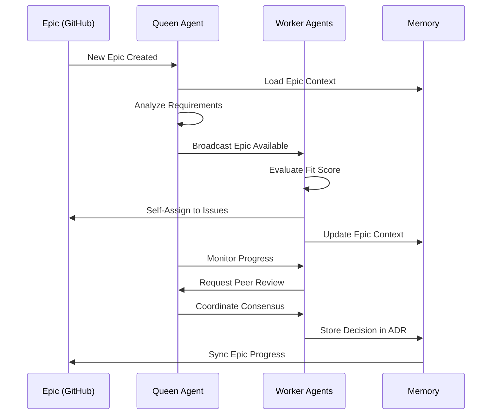
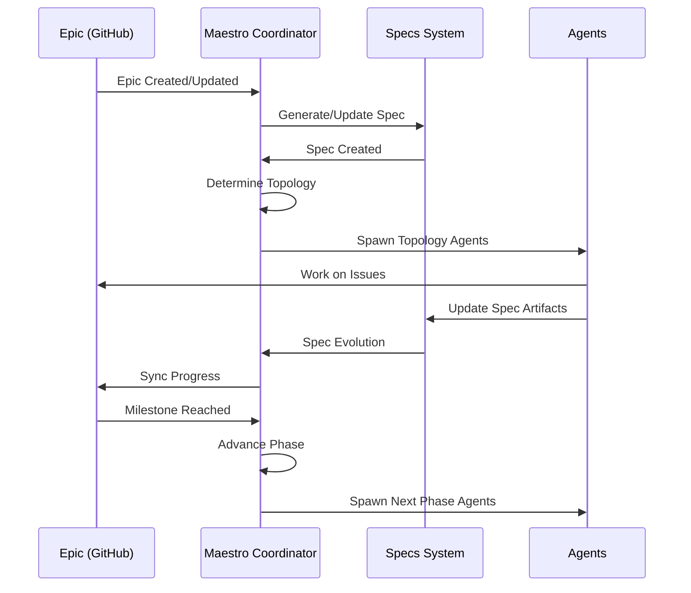
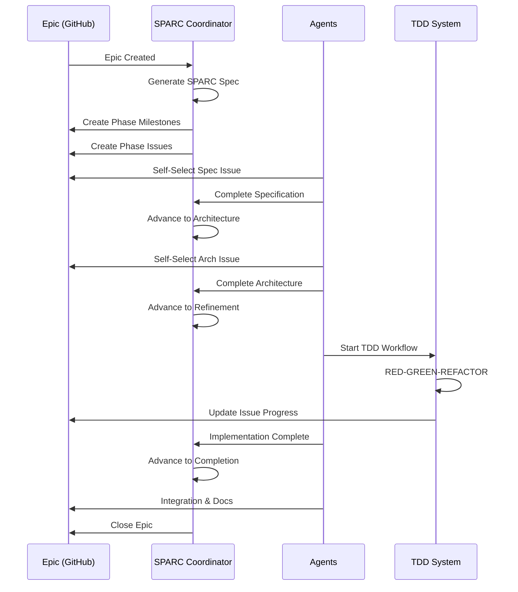
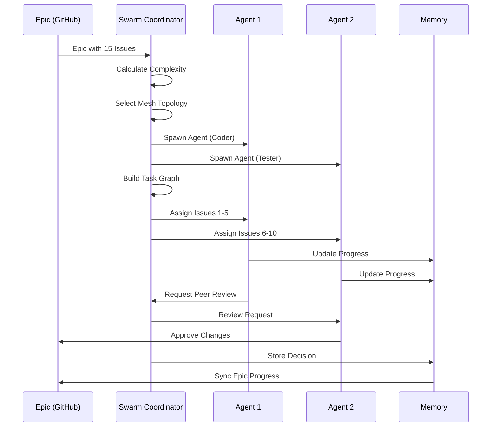
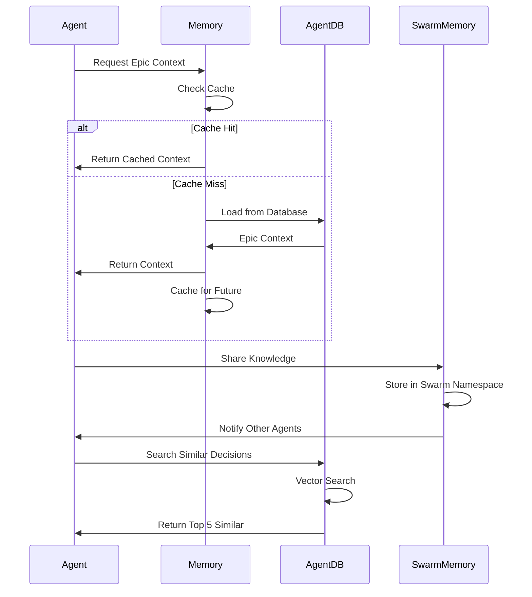
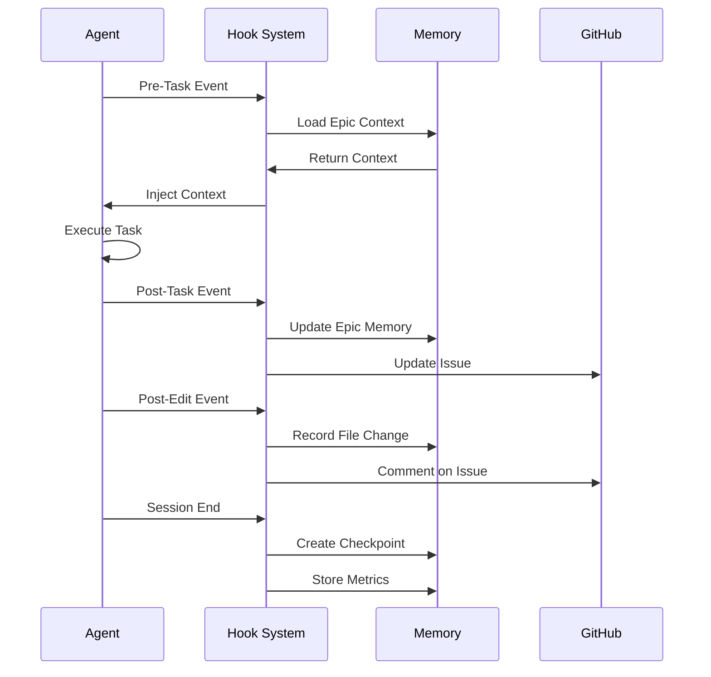
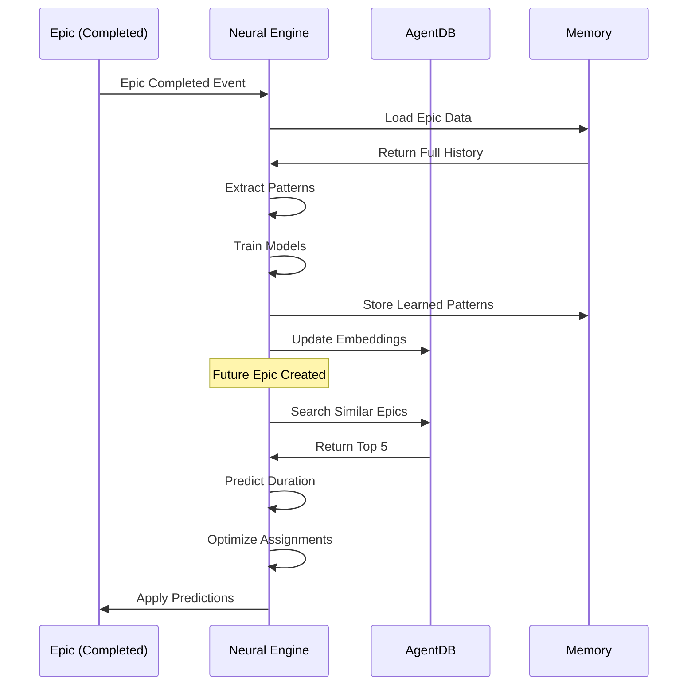
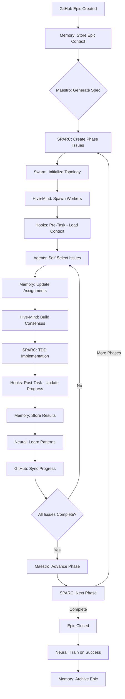
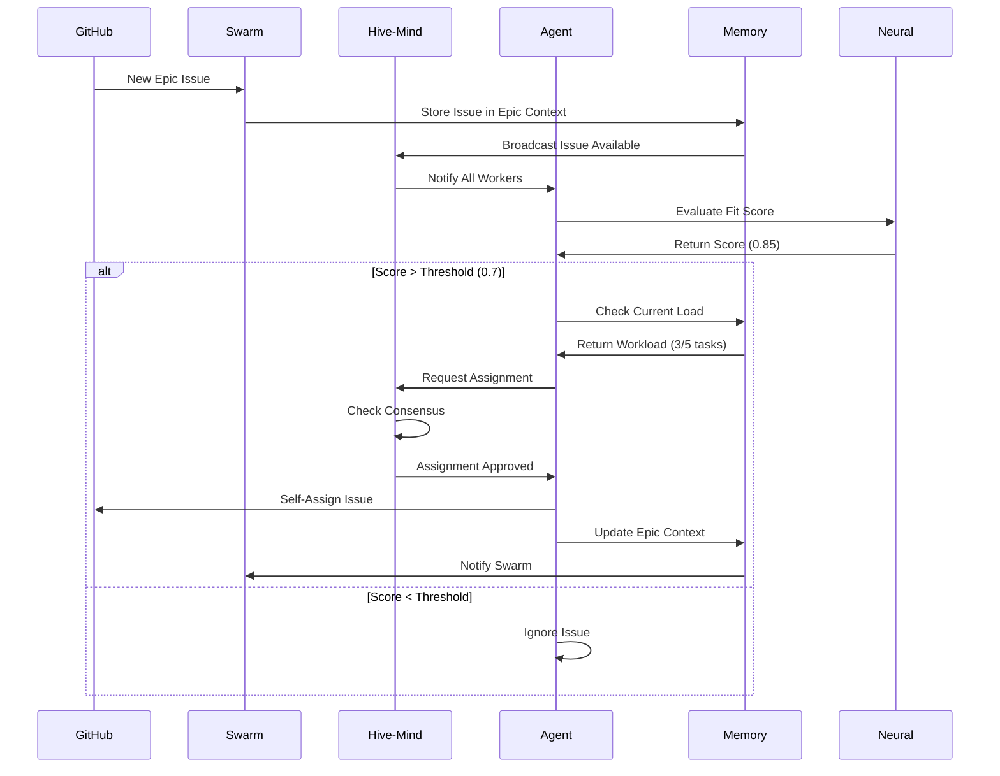
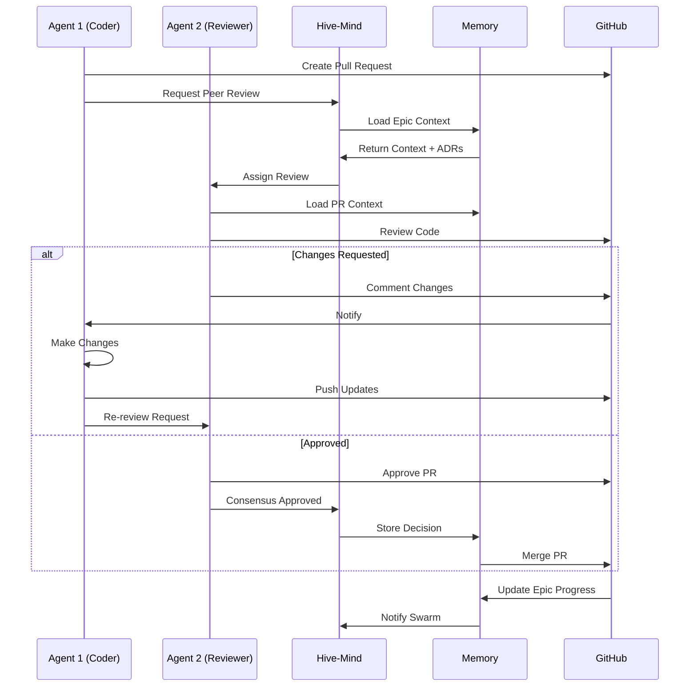

# Teammate-Driven Agent Management - System Integration Matrix

**Version:** 1.0.0
**Date:** 2025-12-09
**Status:** Integration Architecture
**Author:** Research Agent (Systematic Analysis)

---

## Executive Summary

This document provides a comprehensive integration matrix showing how the **Teammate-Driven Agent Management** system (GitHub Epic-based context persistence) integrates with ALL claude-flow tooling systems. The integration transforms claude-flow from task-based orchestration to **teammate-based collaboration** where agents self-select work from epic backlogs, validate peer contributions, and maintain architectural memory across multi-week projects.

**Key Insight:** Each claude-flow system provides a specific capability layer that enhances teammate-driven workflows:
- **Hive-Mind**: Queen-led decision-making and consensus
- **Maestro**: Specs-driven topology and phase management
- **SPARC**: Structured development methodology
- **Swarm Coordination**: Multi-agent task orchestration
- **Memory Systems**: Persistent context and knowledge sharing
- **Hook System**: Automated coordination and state management
- **Neural/Learning**: Pattern recognition and optimization

---

## Table of Contents

1. [Integration Architecture Overview](#integration-architecture-overview)
2. [Hive-Mind Integration](#1-hive-mind-integration)
3. [Maestro Integration](#2-maestro-integration)
4. [SPARC Integration](#3-sparc-integration)
5. [Swarm Coordination Integration](#4-swarm-coordination-integration)
6. [Memory Systems Integration](#5-memory-systems-integration)
7. [Hook System Integration](#6-hook-system-integration)
8. [Neural/Learning Integration](#7-neurallearning-integration)
9. [Cross-System Data Flows](#cross-system-data-flows)
10. [Event Triggers and Handlers](#event-triggers-and-handlers)
11. [Configuration Matrix](#configuration-matrix)
12. [Implementation Roadmap](#implementation-roadmap)

---

## Integration Architecture Overview

### System Layers

```
┌─────────────────────────────────────────────────────────────────────────┐
│                   TEAMMATE-DRIVEN AGENT LAYER                           │
│  • Epic Context Persistence    • Self-Selection   • Peer Validation    │
│  • GitHub Integration          • Progress Tracking • Decision Memory     │
└──────────────────────┬──────────────────────────────────────────────────┘
                       │
       ┌───────────────┼───────────────────────────────────┐
       │               │                                    │
┌──────▼──────┐  ┌────▼─────┐  ┌──────────────┐  ┌───────▼────────┐
│ Hive-Mind   │  │ Maestro  │  │    SPARC     │  │     Swarm      │
│ (Queen-led  │  │ (Specs-  │  │(Methodology) │  │ (Coordination) │
│  Consensus) │  │  Driven) │  │              │  │                │
└──────┬──────┘  └────┬─────┘  └──────┬───────┘  └───────┬────────┘
       │               │                │                   │
       └───────────────┼────────────────┼───────────────────┘
                       │                │
       ┌───────────────┼────────────────┼───────────────────┐
       │               │                │                    │
┌──────▼──────┐  ┌────▼─────┐  ┌──────▼───────┐  ┌────────▼───────┐
│   Memory    │  │   Hooks  │  │    Neural    │  │    GitHub      │
│  (Context   │  │ (Auto-   │  │  (Learning)  │  │  (API/Events)  │
│Persistence) │  │mation)   │  │              │  │                │
└─────────────┘  └──────────┘  └──────────────┘  └────────────────┘
```

### Core Principles

1. **Epic-Centric Context**: All systems read/write context to Epic namespace in memory
2. **Agent Autonomy**: Agents self-select work from epic issues based on capabilities
3. **Peer Coordination**: Swarm/Hive mechanisms enable peer-to-peer collaboration
4. **Persistent Memory**: All decisions, progress, and context survive session boundaries
5. **Event-Driven Sync**: GitHub webhooks trigger bidirectional synchronization

---

## 1. Hive-Mind Integration

### Role in Epic Workflow

**Hive-Mind provides collective decision-making for epic-level architectural choices.**

| Capability | Epic Integration | Data Flow |
|------------|------------------|-----------|
| **Queen-Led Coordination** | Queen evaluates epic requirements and assigns tasks to workers | `Epic Body → Queen Analysis → Task Decomposition → Worker Assignment` |
| **Consensus Mechanisms** | Architectural decisions require swarm consensus before epic update | `Agent Proposals → Consensus Vote → ADR Creation → Epic Memory Update` |
| **Collective Memory** | Shared knowledge base links to epic context | `Epic Context ↔ Collective Memory (epic:{epicId} namespace)` |
| **Worker Specialization** | Workers self-select from epic issues based on specialization | `Epic Issues → Capability Matching → Worker Self-Assignment` |

### Integration Points

#### 1.1 Queen Decision-Making

**File**: `src/coordination/hive-orchestrator.ts`

```typescript
export class HiveOrchestrator extends EventEmitter {
  async evaluateEpicContext(epicId: number): Promise<Decision> {
    // Load epic context from memory
    const epicContext = await this.memory.retrieve(`epic:${epicId}:context`);

    // Queen analyzes requirements and constraints
    const queenAnalysis = await this.queen.analyze(epicContext);

    // Build consensus on approach
    const consensus = await this.buildConsensus(
      'epic-strategy',
      queenAnalysis.options
    );

    // Store decision in epic memory
    await this.memory.store(
      `epic:${epicId}:decisions`,
      consensus,
      'epic',
      { epicId, type: 'strategic-decision' }
    );

    return consensus;
  }
}
```

#### 1.2 Consensus Integration

**Consensus Algorithm Mapping**:

- **Majority Consensus**: Used for tactical decisions (implementation approach, tool selection)
- **Weighted Consensus**: Queen's strategic vision weighted 3x for architectural decisions
- **Byzantine Consensus**: Critical decisions (security, data model) require 2/3 supermajority

```typescript
interface EpicConsensusOptions {
  algorithm: 'majority' | 'weighted' | 'byzantine';
  threshold: number; // 0.5 (majority), 0.6 (weighted), 0.66 (byzantine)
  participantAgents: string[];
  proposal: ArchitecturalDecision;
}

async function buildEpicConsensus(
  epicId: number,
  options: EpicConsensusOptions
): Promise<ConsensusResult> {
  // Retrieve epic context for informed voting
  const context = await memory.retrieve(`epic:${epicId}:context`);

  // Each agent votes based on epic requirements
  const votes = await Promise.all(
    options.participantAgents.map(async (agentId) => {
      const agent = await registry.getAgent(agentId);
      return agent.vote(options.proposal, context);
    })
  );

  // Calculate consensus based on algorithm
  const result = calculateConsensus(votes, options.algorithm, options.threshold);

  // Store in epic memory
  if (result.approved) {
    await adrManager.createADR({
      title: options.proposal.title,
      decision: options.proposal.description,
      consensus: result,
      epicId
    });
  }

  return result;
}
```

#### 1.3 Worker Self-Selection

```typescript
class HiveMindWorker {
  async monitorEpics(): Promise<void> {
    // Poll GitHub for new/updated epics
    const epics = await github.listIssues({
      labels: 'epic',
      state: 'open'
    });

    for (const epic of epics) {
      // Evaluate fit score based on capabilities
      const fitScore = this.evaluateEpicFit(epic);

      if (fitScore > this.config.selectionThreshold) {
        // Self-assign to epic
        await this.assignToEpic(epic.number);

        // Select issue from epic backlog
        const issue = await this.selectIssueFromBacklog(epic.number);

        // Update epic context with assignment
        await memory.store(
          `epic:${epic.number}:agents`,
          { agentId: this.id, issueId: issue.number },
          'epic'
        );
      }
    }
  }

  evaluateEpicFit(epic: Epic): number {
    const keywords = this.extractKeywords(epic.body);
    const capabilityMatch = this.capabilities.filter(c =>
      keywords.some(k => k.includes(c))
    ).length;

    return capabilityMatch / this.capabilities.length;
  }
}
```

### Configuration

```javascript
// .claude-flow/hive-mind-epic-config.json
{
  "epicIntegration": {
    "enabled": true,
    "queenType": "strategic",  // Strategic decisions for epics
    "consensusAlgorithm": "weighted",  // Queen guidance weighted
    "workerSelfSelection": true,
    "autoScaling": {
      "enabled": true,
      "minWorkers": 3,
      "maxWorkers": 12,
      "scaleOnBacklogSize": 5  // Scale up if >5 pending issues per worker
    }
  },
  "memoryIntegration": {
    "epicNamespace": "epic",
    "ttl": null,  // Permanent epic memory
    "consolidation": "daily"
  }
}
```

### Event Flows



---

## 2. Maestro Integration

### Role in Epic Workflow

**Maestro provides specs-driven topology and phase-based workflow management for epics.**

| Capability | Epic Integration | Data Flow |
|------------|------------------|-----------|
| **Specs-Driven Topology** | Epic body becomes living specification document | `Epic Body → Maestro Spec → Swarm Topology Auto-Generated` |
| **Phase Management** | Epic milestones map to Maestro workflow phases | `Epic Milestones → Maestro Phases → Task Orchestration` |
| **Requirements Analysis** | Dedicated agent analyzes epic requirements | `Epic Description → Requirements Agent → Structured Spec` |
| **Living Documentation** | Specs evolve with epic updates | `Epic Updates → Spec Regeneration → Documentation Sync` |

### Integration Points

#### 2.1 Epic to Maestro Spec Conversion

**File**: `src/maestro/maestro-swarm-coordinator.ts`

```typescript
export class MaestroSwarmCoordinator {
  async createSpecFromEpic(epicId: number): Promise<MaestroSpec> {
    // Fetch epic from GitHub
    const epic = await this.github.getIssue(epicId);

    // Parse epic body into structured spec
    const spec: MaestroSpec = {
      featureName: epic.title,
      requirements: this.parseRequirements(epic.body),
      architecture: this.parseArchitecture(epic.body),
      acceptanceCriteria: this.parseAcceptanceCriteria(epic.body),
      constraints: this.parseConstraints(epic.body),
      milestones: epic.milestones?.map(m => ({
        name: m.title,
        phase: this.mapToWorkflowPhase(m.description),
        dueDate: m.due_on
      })) || []
    };

    // Store in epic memory
    await this.memory.store(
      `epic:${epicId}:maestro-spec`,
      spec,
      'epic'
    );

    // Auto-generate swarm topology based on spec complexity
    const topology = this.determineTopology(spec);
    await this.initializeSwarmTopology(topology, spec);

    return spec;
  }

  private mapToWorkflowPhase(description: string): WorkflowPhase {
    // Map epic milestone to Maestro phase
    const phaseMapping = {
      'requirements': 'Requirements Clarification',
      'design': 'Spec Creation',
      'architecture': 'Spec Creation',
      'implementation': 'Implementation',
      'testing': 'Testing & Validation',
      'documentation': 'Final Documentation',
      'deployment': 'Implementation'
    };

    for (const [keyword, phase] of Object.entries(phaseMapping)) {
      if (description.toLowerCase().includes(keyword)) {
        return phase as WorkflowPhase;
      }
    }

    return 'Requirements Clarification';
  }
}
```

#### 2.2 Phase-Based Epic Progress

```typescript
class EpicPhaseManager {
  private maestroPhases: WorkflowPhase[] = [
    'Requirements Clarification',
    'Spec Creation',
    'Implementation',
    'Testing & Validation',
    'Final Documentation'
  ];

  async advanceEpicPhase(epicId: number): Promise<void> {
    // Get current phase from memory
    const currentPhase = await this.memory.retrieve(
      `epic:${epicId}:current-phase`
    );

    // Check if phase completion criteria met
    const isPhaseComplete = await this.checkPhaseCompletion(
      epicId,
      currentPhase
    );

    if (isPhaseComplete) {
      // Move to next phase
      const nextPhaseIndex = this.maestroPhases.indexOf(currentPhase) + 1;

      if (nextPhaseIndex < this.maestroPhases.length) {
        const nextPhase = this.maestroPhases[nextPhaseIndex];

        // Update epic memory
        await this.memory.store(
          `epic:${epicId}:current-phase`,
          nextPhase,
          'epic'
        );

        // Update GitHub epic milestone
        await this.github.updateIssue(epicId, {
          milestone: this.findMilestoneForPhase(nextPhase)
        });

        // Trigger phase-specific agents
        await this.spawnPhaseAgents(epicId, nextPhase);
      }
    }
  }

  private async checkPhaseCompletion(
    epicId: number,
    phase: WorkflowPhase
  ): Promise<boolean> {
    const phaseCompletionCriteria = {
      'Requirements Clarification': async () => {
        const spec = await this.memory.retrieve(`epic:${epicId}:maestro-spec`);
        return spec && spec.requirements && spec.requirements.length > 0;
      },
      'Spec Creation': async () => {
        const spec = await this.memory.retrieve(`epic:${epicId}:maestro-spec`);
        return spec && spec.architecture && spec.architecture.components;
      },
      'Implementation': async () => {
        const tasks = await this.memory.retrieve(`epic:${epicId}:tasks`);
        return tasks.every(t => t.status === 'completed');
      },
      'Testing & Validation': async () => {
        const coverage = await this.memory.retrieve(`epic:${epicId}:coverage`);
        return coverage >= 90;
      },
      'Final Documentation': async () => {
        const docs = await this.memory.retrieve(`epic:${epicId}:docs`);
        return docs && docs.complete;
      }
    };

    return await phaseCompletionCriteria[phase]();
  }
}
```

#### 2.3 Steering Integration

```typescript
class MaestroSteeringIntegration {
  async syncSteeringToEpic(epicId: number): Promise<void> {
    // Load steering documents
    const steeringPath = join(this.steeringDirectory, `epic-${epicId}`);
    const steeringDocs = await this.loadSteeringDocs(steeringPath);

    // Store in epic memory for agent access
    await this.memory.store(
      `epic:${epicId}:steering`,
      steeringDocs,
      'epic',
      { type: 'guidance', persistent: true }
    );

    // Notify agents of new steering
    this.eventBus.emit('epic:steering-updated', {
      epicId,
      steeringDocs
    });
  }

  async updateEpicFromSteering(epicId: number): Promise<void> {
    const steering = await this.memory.retrieve(`epic:${epicId}:steering`);

    // Parse steering for requirements updates
    const updates = this.parseSteeringUpdates(steering);

    if (updates.requirements || updates.constraints) {
      // Update Maestro spec
      const spec = await this.memory.retrieve(`epic:${epicId}:maestro-spec`);
      const updatedSpec = this.mergeSteeringUpdates(spec, updates);

      await this.memory.store(
        `epic:${epicId}:maestro-spec`,
        updatedSpec,
        'epic'
      );

      // Sync to GitHub epic body
      await this.github.updateIssue(epicId, {
        body: this.formatSpecAsMarkdown(updatedSpec)
      });
    }
  }
}
```

### Configuration

```javascript
// .claude-flow/maestro-epic-config.json
{
  "specsDirectory": ".claude/claude-flow/maestro/specs",
  "steeringDirectory": ".claude/claude-flow/maestro/steering",
  "epicIntegration": {
    "autoCreateSpec": true,
    "syncInterval": 300000,  // 5 minutes
    "phaseMapping": {
      "requirements": "Requirements Clarification",
      "design": "Spec Creation",
      "implementation": "Implementation",
      "testing": "Testing & Validation",
      "docs": "Final Documentation"
    },
    "livingDocumentation": {
      "enabled": true,
      "format": "markdown",
      "includeInEpicBody": true
    }
  },
  "topologySelection": {
    "simple": "star",           // 1-3 agents
    "moderate": "hierarchical", // 4-8 agents
    "complex": "mesh"           // 9+ agents
  }
}
```

### Event Flows



---

## 3. SPARC Integration

### Role in Epic Workflow

**SPARC provides structured development methodology that maps directly to epic issues.**

| Capability | Epic Integration | Data Flow |
|------------|------------------|-----------|
| **Specification Phase** | Epic requirements become SPARC specification | `Epic Body → SPARC Spec → Requirement Issues` |
| **Architecture Phase** | Architectural decisions stored as ADRs in epic | `SPARC Architecture → ADR Creation → Epic Memory` |
| **Refinement Phase** | TDD implementation tracked per epic issue | `Epic Issues → TDD Workflow → Test Coverage Tracking` |
| **Completion Phase** | Epic closure triggers integration and documentation | `All Issues Closed → SPARC Completion → Epic Closed` |

### Integration Points

#### 3.1 Epic-Driven SPARC Workflow

**File**: New - `src/sparc/epic-driven-workflow.ts`

```typescript
export class EpicDrivenSPARCWorkflow {
  async initializeFromEpic(epicId: number): Promise<SPARCWorkflowState> {
    const epic = await this.github.getIssue(epicId);

    // Phase 1: Specification from Epic
    const specification = await this.generateSpecification(epic);
    await this.memory.store(
      `epic:${epicId}:sparc-spec`,
      specification,
      'epic'
    );

    // Create specification issues in epic
    const specIssues = await this.createSpecificationIssues(
      epicId,
      specification
    );

    return {
      epicId,
      currentPhase: 'specification',
      specification,
      specIssues
    };
  }

  private async createSpecificationIssues(
    epicId: number,
    spec: Specification
  ): Promise<number[]> {
    const issueIds: number[] = [];

    // Create requirement analysis issue
    const reqIssue = await this.github.createIssue({
      title: `[SPARC Spec] Requirements Analysis`,
      body: this.formatRequirements(spec.requirements),
      labels: ['sparc:specification', 'phase:spec'],
      milestone: this.getEpicMilestone(epicId, 'specification')
    });
    issueIds.push(reqIssue.number);

    // Create constraint identification issue
    const constraintIssue = await this.github.createIssue({
      title: `[SPARC Spec] Technical Constraints`,
      body: this.formatConstraints(spec.constraints),
      labels: ['sparc:specification', 'phase:spec'],
      milestone: this.getEpicMilestone(epicId, 'specification')
    });
    issueIds.push(constraintIssue.number);

    // Link issues to epic
    for (const issueId of issueIds) {
      await this.github.createIssueComment(issueId, {
        body: `Part of epic #${epicId}`
      });
    }

    return issueIds;
  }
}
```

#### 3.2 TDD Integration with Epic Issues

```typescript
class TDDEpicIntegration {
  async implementIssueWithTDD(
    epicId: number,
    issueId: number
  ): Promise<TDDResult> {
    // Load epic context
    const context = await this.memory.retrieve(`epic:${epicId}:context`);

    // Load SPARC specification
    const spec = await this.memory.retrieve(`epic:${epicId}:sparc-spec`);

    // RED: Create failing tests based on acceptance criteria
    const tests = await this.createFailingTests(issueId, spec);

    // Update issue with test results
    await this.github.createIssueComment(issueId, {
      body: `## TDD - RED Phase\n\nCreated ${tests.length} failing tests:\n${tests.map(t => `- [ ] ${t.name}`).join('\n')}`
    });

    // GREEN: Implement minimum code
    const implementation = await this.implementMinimumCode(issueId, tests);

    // Run tests
    const testResults = await this.runTests(tests);

    // REFACTOR: Improve code quality
    if (testResults.passed) {
      await this.refactorCode(implementation, spec.constraints);

      // Update epic memory with completion
      await this.memory.store(
        `epic:${epicId}:tasks:${issueId}`,
        {
          status: 'completed',
          testCoverage: testResults.coverage,
          completedAt: Date.now()
        },
        'epic'
      );

      // Close issue
      await this.github.updateIssue(issueId, {
        state: 'closed',
        labels: [...existing, 'completed', 'tested']
      });
    }

    return {
      tests,
      implementation,
      testResults
    };
  }
}
```

#### 3.3 SPARC Phase to Epic Milestone Mapping

```typescript
class SPARCEpicPhaseMapper {
  private phaseMapping = {
    'specification': {
      milestone: 'Requirements & Spec',
      issues: ['requirements', 'constraints', 'acceptance-criteria'],
      agents: ['researcher', 'analyzer', 'architect']
    },
    'pseudocode': {
      milestone: 'Architecture Design',
      issues: ['algorithm-design', 'data-structures'],
      agents: ['architect', 'designer']
    },
    'architecture': {
      milestone: 'System Architecture',
      issues: ['component-design', 'api-contracts', 'database-schema'],
      agents: ['architect', 'system-architect', 'api-docs']
    },
    'refinement': {
      milestone: 'Implementation',
      issues: ['feature-implementation', 'unit-tests', 'integration-tests'],
      agents: ['coder', 'tester', 'tdd-london-swarm']
    },
    'completion': {
      milestone: 'Integration & Deployment',
      issues: ['integration', 'documentation', 'deployment'],
      agents: ['workflow-manager', 'documenter', 'cicd-engineer']
    }
  };

  async createEpicMilestones(epicId: number): Promise<void> {
    const epic = await this.github.getIssue(epicId);

    for (const [phase, config] of Object.entries(this.phaseMapping)) {
      // Create milestone for phase
      const milestone = await this.github.createMilestone({
        title: config.milestone,
        description: `SPARC ${phase} phase for ${epic.title}`,
        due_on: this.calculateDueDate(phase)
      });

      // Create phase issues
      for (const issueType of config.issues) {
        await this.github.createIssue({
          title: `[${phase.toUpperCase()}] ${issueType}`,
          body: `SPARC ${phase} phase task\n\nPart of epic #${epicId}`,
          milestone: milestone.number,
          labels: [`sparc:${phase}`, issueType],
          assignees: []  // Self-selection enabled
        });
      }

      // Store phase config in memory
      await this.memory.store(
        `epic:${epicId}:sparc:phase:${phase}`,
        {
          milestone: milestone.number,
          agents: config.agents,
          issues: config.issues
        },
        'epic'
      );
    }
  }
}
```

### Configuration

```javascript
// .claude-flow/sparc-epic-config.json
{
  "epicIntegration": {
    "autoGeneratePhases": true,
    "phaseIssueCreation": "automatic",
    "tddWorkflow": {
      "enabled": true,
      "coverageTarget": 90,
      "testFramework": "jest",
      "e2eFramework": "playwright"
    },
    "issueLabels": {
      "specification": ["sparc:spec", "phase:specification"],
      "architecture": ["sparc:arch", "phase:architecture"],
      "refinement": ["sparc:refine", "phase:implementation"],
      "completion": ["sparc:complete", "phase:integration"]
    }
  },
  "agentAssignment": {
    "selfSelection": true,
    "phaseAgents": {
      "specification": ["researcher", "analyzer"],
      "architecture": ["architect", "system-architect"],
      "refinement": ["coder", "tester", "tdd-london-swarm"],
      "completion": ["documenter", "cicd-engineer"]
    }
  }
}
```

### Event Flows



---

## 4. Swarm Coordination Integration

### Role in Epic Workflow

**Swarm Coordination provides multi-agent orchestration patterns for epic-based work.**

| Capability | Epic Integration | Data Flow |
|------------|------------------|-----------|
| **Topology Selection** | Epic complexity determines swarm topology | `Epic Size → Topology Auto-Selection → Agent Spawning` |
| **Task Decomposition** | Epic issues decomposed into swarm tasks | `Epic Issues → Task Graph → Agent Assignment` |
| **Load Balancing** | Work distributed across available agents | `Backlog → Capability Matching → Dynamic Assignment` |
| **Fault Tolerance** | Agent failures don't block epic progress | `Agent Failure → Task Reassignment → Continued Execution` |

### Integration Points

#### 4.1 Epic-Driven Topology Selection

**File**: `src/swarm/epic-topology-selector.ts`

```typescript
export class EpicTopologySelector {
  selectTopology(epicContext: EpicContext): SwarmTopology {
    const complexity = this.calculateComplexity(epicContext);
    const agentCount = this.estimateRequiredAgents(epicContext);

    // Topology selection matrix
    if (agentCount <= 3) {
      return 'star';  // Simple coordination, single coordinator
    } else if (agentCount <= 8 && complexity < 0.6) {
      return 'hierarchical';  // Structured delegation
    } else if (agentCount <= 12 && complexity >= 0.6) {
      return 'mesh';  // Peer-to-peer collaboration
    } else {
      return 'adaptive';  // Dynamic topology based on workload
    }
  }

  private calculateComplexity(epic: EpicContext): number {
    const factors = {
      issueCount: epic.issues.length / 50,  // Normalized
      dependencies: epic.dependencies.length / 20,
      requiresConsensus: epic.decisions.length / 10,
      technicalConstraints: epic.constraints.length / 15
    };

    // Weighted average
    return (
      factors.issueCount * 0.3 +
      factors.dependencies * 0.25 +
      factors.requiresConsensus * 0.25 +
      factors.technicalConstraints * 0.2
    );
  }

  private estimateRequiredAgents(epic: EpicContext): number {
    // Estimate based on issue types and workload
    const baseAgents = 2;  // Minimum: coordinator + worker

    const specializations = new Set(
      epic.issues.map(i => this.classifyIssueType(i))
    );

    return baseAgents + specializations.size;
  }
}
```

#### 4.2 Task Orchestration from Epic Issues

```typescript
class SwarmEpicOrchestrator {
  async orchestrateEpicWork(epicId: number): Promise<OrchestrationResult> {
    // Load epic context and issues
    const context = await this.memory.retrieve(`epic:${epicId}:context`);
    const issues = await this.github.listIssues({
      milestone: context.milestone,
      state: 'open'
    });

    // Build task dependency graph
    const taskGraph = this.buildTaskGraph(issues);

    // Initialize swarm with appropriate topology
    const topology = this.topologySelector.selectTopology(context);
    await this.swarm.init({ topology, maxAgents: 12 });

    // Spawn agents based on required capabilities
    const requiredCapabilities = this.analyzeCapabilities(issues);
    for (const capability of requiredCapabilities) {
      await this.swarm.spawnAgent({ type: capability });
    }

    // Orchestrate task execution
    const strategy = this.determineStrategy(taskGraph);
    await this.swarm.orchestrateTask({
      task: `Complete epic ${epicId}`,
      strategy,
      dependencies: taskGraph
    });

    // Monitor and coordinate
    this.monitorEpicProgress(epicId);

    return {
      swarmId: this.swarm.id,
      topology,
      agents: this.swarm.getAgents(),
      taskGraph
    };
  }

  private buildTaskGraph(issues: Issue[]): TaskGraph {
    const graph: TaskGraph = { nodes: [], edges: [] };

    for (const issue of issues) {
      // Parse dependencies from issue body
      const dependencies = this.parseDependencies(issue.body);

      graph.nodes.push({
        id: issue.number.toString(),
        type: this.classifyIssueType(issue),
        priority: this.calculatePriority(issue),
        estimatedDuration: this.estimateDuration(issue)
      });

      for (const dep of dependencies) {
        graph.edges.push({
          from: dep,
          to: issue.number.toString(),
          type: 'blocks'
        });
      }
    }

    return graph;
  }
}
```

#### 4.3 Dynamic Agent Assignment

```typescript
class DynamicAgentAssigner {
  async assignAgentsToEpicIssues(
    epicId: number,
    swarmId: string
  ): Promise<AssignmentResult> {
    // Get active agents in swarm
    const agents = await this.swarm.listAgents({ swarmId, filter: 'active' });

    // Get pending issues
    const issues = await this.github.listIssues({
      milestone: this.getEpicMilestone(epicId),
      state: 'open',
      labels: 'pending'
    });

    // Capability-based matching
    const assignments: Assignment[] = [];

    for (const issue of issues) {
      // Determine required capabilities
      const requiredCapabilities = this.analyzeIssueCapabilities(issue);

      // Find best-fit agent
      const bestAgent = agents.find(agent =>
        requiredCapabilities.every(cap => agent.capabilities.includes(cap))
      );

      if (bestAgent) {
        // Assign issue to agent
        await this.github.updateIssue(issue.number, {
          assignees: [bestAgent.githubUser],
          labels: [...issue.labels, 'assigned']
        });

        // Update epic memory
        await this.memory.store(
          `epic:${epicId}:assignments:${issue.number}`,
          {
            agentId: bestAgent.id,
            assignedAt: Date.now(),
            status: 'assigned'
          },
          'epic'
        );

        assignments.push({
          issueId: issue.number,
          agentId: bestAgent.id,
          capabilities: requiredCapabilities
        });
      }
    }

    return { assignments, unassignedIssues: [] };
  }
}
```

### Configuration

```javascript
// .claude-flow/swarm-epic-config.json
{
  "epicIntegration": {
    "topologySelection": {
      "auto": true,
      "override": null,  // Force specific topology
      "rules": {
        "simple": { "maxIssues": 10, "topology": "star" },
        "moderate": { "maxIssues": 30, "topology": "hierarchical" },
        "complex": { "maxIssues": 100, "topology": "mesh" }
      }
    },
    "taskOrchestration": {
      "strategy": "adaptive",  // parallel | sequential | adaptive
      "maxConcurrentTasks": 5,
      "dependencyResolution": "automatic"
    },
    "agentManagement": {
      "autoSpawn": true,
      "maxAgents": 12,
      "capabilityMatching": true,
      "loadBalancing": "round-robin"
    }
  }
}
```

### Event Flows



---

## 5. Memory Systems Integration

### Role in Epic Workflow

**Memory Systems provide persistent context storage and retrieval across sessions.**

| Capability | Epic Integration | Data Flow |
|------------|------------------|-----------|
| **Epic Context Storage** | All epic data stored in dedicated namespace | `Epic Data → memory.store('epic:{epicId}', ...) → SQLite/JSON` |
| **Cross-Session Persistence** | Epic context survives session restarts | `Session End → Context Saved → Session Start → Context Restored` |
| **Swarm Memory** | Shared knowledge across all agents in epic | `Agent Updates → SwarmMemory → All Agents Access` |
| **AgentDB Vector Search** | Semantic search of architectural decisions | `Query → AgentDB → Relevant ADRs` |

### Integration Points

#### 5.1 Epic Context Storage

**File**: `src/memory/epic-memory-integration.ts`

```typescript
export class EpicMemoryIntegration {
  constructor(
    private memory: UnifiedMemoryManager,
    private agentDB: AgentDBClient
  ) {}

  async storeEpicContext(epicId: number, context: EpicContext): Promise<void> {
    // Store in unified memory
    await this.memory.store(
      `epic:${epicId}:context`,
      context,
      'epic',
      {
        ttl: null,  // Permanent
        epicId,
        version: context.version,
        hash: this.hashContext(context)
      }
    );

    // Store in AgentDB for semantic search
    if (context.decisions && context.decisions.length > 0) {
      for (const decision of context.decisions) {
        await this.agentDB.insert({
          collection: 'epic-decisions',
          document: {
            id: `epic-${epicId}-decision-${decision.id}`,
            epicId,
            decision: decision.description,
            rationale: decision.rationale,
            timestamp: decision.timestamp
          },
          metadata: {
            epicId,
            decisionType: decision.type
          }
        });
      }
    }
  }

  async retrieveEpicContext(epicId: number): Promise<EpicContext | null> {
    // Try cache first
    const cached = await this.memory.retrieve(`epic:${epicId}:context`);

    if (cached) {
      return cached;
    }

    // Load from GitHub if not in memory
    const epic = await this.github.getIssue(epicId);
    const context = await this.buildContextFromEpic(epic);

    // Cache for future access
    await this.storeEpicContext(epicId, context);

    return context;
  }

  async searchEpicDecisions(query: string, limit: number = 10): Promise<Decision[]> {
    // Vector search using AgentDB
    const results = await this.agentDB.search({
      collection: 'epic-decisions',
      query,
      limit,
      threshold: 0.7
    });

    return results.map(r => ({
      id: r.metadata.decisionId,
      epicId: r.metadata.epicId,
      description: r.document.decision,
      rationale: r.document.rationale,
      similarity: r.score
    }));
  }
}
```

#### 5.2 Swarm Memory for Epic Teams

```typescript
class EpicSwarmMemory {
  private swarmMemory: SwarmMemory;

  async initializeForEpic(epicId: number, swarmId: string): Promise<void> {
    // Create swarm-specific memory namespace
    this.swarmMemory = new SwarmMemory({
      swarmId,
      namespace: `epic:${epicId}:swarm`,
      ttl: 86400000,  // 24 hours
      maxSize: 100  // MB
    });

    await this.swarmMemory.initialize();

    // Load epic context into swarm memory
    const context = await this.memory.retrieve(`epic:${epicId}:context`);
    await this.swarmMemory.storeTask('epic-context', context);
  }

  async shareKnowledge(
    epicId: number,
    fromAgentId: string,
    knowledge: any
  ): Promise<void> {
    // Store in swarm memory for all agents to access
    await this.swarmMemory.store(
      `shared:${fromAgentId}:${Date.now()}`,
      knowledge,
      {
        sharedBy: fromAgentId,
        epicId,
        timestamp: Date.now()
      }
    );

    // Notify other agents
    this.eventBus.emit('epic:knowledge-shared', {
      epicId,
      agentId: fromAgentId,
      knowledgeKey: `shared:${fromAgentId}:${Date.now()}`
    });
  }
}
```

#### 5.3 Memory-Based Context Restoration

```typescript
class ContextRestoration {
  async restoreEpicContextForAgent(
    epicId: number,
    agentId: string
  ): Promise<RestoredContext> {
    // Load epic context
    const epicContext = await this.memory.retrieve(`epic:${epicId}:context`);

    // Load agent's previous work on epic
    const agentHistory = await this.memory.search(
      `epic:${epicId}:agents:${agentId}:*`
    );

    // Load relevant ADRs using semantic search
    const relevantDecisions = await this.agentDB.search({
      collection: 'epic-decisions',
      query: epicContext.description,
      limit: 5
    });

    // Load recent swarm communications
    const recentComms = await this.swarmMemory.search(
      `shared:*`,
      { since: Date.now() - 3600000 }  // Last hour
    );

    // Build consolidated context
    const context: RestoredContext = {
      epic: epicContext,
      agentHistory,
      relevantDecisions,
      recentCommunications: recentComms,
      currentTasks: epicContext.tasks.filter(t => t.assignedTo === agentId),
      timestamp: Date.now()
    };

    // Inject into agent's working memory
    await this.injectContext(agentId, context);

    return context;
  }
}
```

### Configuration

```javascript
// .claude-flow/memory-epic-config.json
{
  "epicMemory": {
    "namespace": "epic",
    "ttl": null,  // Permanent
    "storage": {
      "primary": "sqlite",
      "fallback": "json",
      "enableAgentDB": true
    },
    "caching": {
      "enabled": true,
      "ttl": 300000,  // 5 minutes
      "maxSize": 1000
    }
  },
  "swarmMemory": {
    "enabled": true,
    "ttl": 86400000,  // 24 hours
    "maxSize": 100,  // MB per swarm
    "consolidation": "hourly"
  },
  "agentDB": {
    "enabled": true,
    "collections": {
      "epicDecisions": {
        "dimensions": 384,
        "distanceMetric": "cosine"
      },
      "epicRequirements": {
        "dimensions": 384,
        "distanceMetric": "cosine"
      }
    }
  }
}
```

### Event Flows



---

## 6. Hook System Integration

### Role in Epic Workflow

**Hook System provides automated coordination and state management throughout epic lifecycle.**

| Capability | Epic Integration | Data Flow |
|------------|------------------|-----------|
| **Pre-Task Hooks** | Restore epic context before agent starts work | `Agent Spawned → Pre-Task Hook → Context Restored` |
| **Post-Task Hooks** | Update epic progress after task completion | `Task Complete → Post-Task Hook → Epic Memory Updated` |
| **Post-Edit Hooks** | Track file changes to epic | `File Edited → Post-Edit Hook → Epic Files Updated` |
| **Session Hooks** | Persist/restore epic state across sessions | `Session End → Checkpoint → Session Start → Restore` |

### Integration Points

#### 6.1 Pre-Task Hook: Epic Context Restoration

**File**: `src/services/agentic-flow-hooks/epic-hooks.ts`

```typescript
export class EpicHooks {
  async preTaskHook(taskData: TaskData): Promise<void> {
    if (!taskData.epicId) return;

    // Restore epic context for agent
    const context = await this.contextRestoration.restoreEpicContext(
      taskData.epicId,
      taskData.agentId
    );

    // Load relevant ADRs
    const decisions = await this.adrManager.getADRsByEpic(taskData.epicId);

    // Load steering documents
    const steering = await this.memory.retrieve(
      `epic:${taskData.epicId}:steering`
    );

    // Inject into agent working memory
    await this.injectContextIntoAgent(taskData.agentId, {
      epicContext: context,
      architecturalDecisions: decisions,
      steering
    });

    // Log hook execution
    this.logger.info(`Pre-task hook executed for epic ${taskData.epicId}`);
  }

  async postTaskHook(taskResult: TaskResult): Promise<void> {
    if (!taskResult.epicId) return;

    // Update epic context with task results
    await this.memory.store(
      `epic:${taskResult.epicId}:tasks:${taskResult.taskId}`,
      {
        status: 'completed',
        result: taskResult.summary,
        completedBy: taskResult.agentId,
        completedAt: Date.now()
      },
      'epic'
    );

    // Update GitHub issue
    if (taskResult.issueId) {
      await this.github.createIssueComment(taskResult.issueId, {
        body: `## Task Completed\n\n${taskResult.summary}\n\n**Agent:** ${taskResult.agentId}\n**Duration:** ${taskResult.duration}ms`
      });

      // Close issue if all acceptance criteria met
      if (taskResult.allCriteriaMet) {
        await this.github.updateIssue(taskResult.issueId, {
          state: 'closed',
          labels: [...taskResult.labels, 'completed']
        });
      }
    }

    // Check if epic should advance phase
    await this.checkPhaseAdvancement(taskResult.epicId);
  }
}
```

#### 6.2 Post-Edit Hook: File Change Tracking

```typescript
class FileChangeTracker {
  async postEditHook(editData: EditData): Promise<void> {
    if (!editData.epicId) return;

    // Record file change in epic context
    await this.memory.store(
      `epic:${editData.epicId}:files:${editData.filepath}`,
      {
        operation: editData.operation,  // created | modified | deleted
        agentId: editData.agentId,
        taskId: editData.taskId,
        timestamp: Date.now(),
        diff: editData.diff
      },
      'epic',
      { append: true }
    );

    // Update GitHub if file is significant
    if (this.isSignificantFile(editData.filepath)) {
      await this.github.createIssueComment(editData.issueId, {
        body: `**File Updated:** \`${editData.filepath}\`\n**By:** ${editData.agentId}`
      });
    }

    // Trigger neural training on patterns
    await this.neuralHooks.trainOnEditPattern(editData);
  }
}
```

#### 6.3 Session Hooks: Epic State Persistence

```typescript
class EpicSessionManager {
  async sessionStartHook(sessionData: SessionData): Promise<void> {
    if (!sessionData.epicId) return;

    // Check for existing epic checkpoint
    const checkpoint = await this.memory.retrieve(
      `epic:${sessionData.epicId}:checkpoint:latest`
    );

    if (checkpoint) {
      // Restore from checkpoint
      await this.restoreFromCheckpoint(checkpoint);

      this.logger.info(`Restored epic ${sessionData.epicId} from checkpoint`);
    } else {
      // Initialize new epic session
      await this.initializeEpicSession(sessionData.epicId);
    }
  }

  async sessionEndHook(sessionData: SessionData): Promise<void> {
    if (!sessionData.epicId) return;

    // Create checkpoint of current epic state
    const checkpoint = await this.createEpicCheckpoint(sessionData.epicId);

    // Store as latest checkpoint
    await this.memory.store(
      `epic:${sessionData.epicId}:checkpoint:latest`,
      checkpoint,
      'epic',
      { permanent: true }
    );

    // Export metrics
    const metrics = await this.collectEpicMetrics(sessionData.epicId);
    await this.memory.store(
      `epic:${sessionData.epicId}:metrics`,
      metrics,
      'epic'
    );

    this.logger.info(`Session ended for epic ${sessionData.epicId}, checkpoint created`);
  }

  private async createEpicCheckpoint(epicId: number): Promise<Checkpoint> {
    return {
      epicId,
      timestamp: Date.now(),
      context: await this.memory.retrieve(`epic:${epicId}:context`),
      tasks: await this.memory.search(`epic:${epicId}:tasks:*`),
      agents: await this.memory.search(`epic:${epicId}:agents:*`),
      decisions: await this.adrManager.getADRsByEpic(epicId),
      files: await this.memory.search(`epic:${epicId}:files:*`)
    };
  }
}
```

### Configuration

```javascript
// .claude-flow/hooks-epic-config.json
{
  "epicHooks": {
    "enabled": true,
    "preTask": {
      "restoreContext": true,
      "loadADRs": true,
      "loadSteering": true
    },
    "postTask": {
      "updateEpicMemory": true,
      "syncGitHub": true,
      "checkPhaseAdvancement": true
    },
    "postEdit": {
      "trackFileChanges": true,
      "significantFilesOnly": false,
      "updateGitHub": true
    },
    "session": {
      "createCheckpoints": true,
      "checkpointInterval": 3600000,  // 1 hour
      "autoRestore": true
    }
  },
  "neural": {
    "trainOnPatterns": true,
    "patternTypes": ["file-edits", "task-completion", "decision-making"]
  }
}
```

### Event Flows



---

## 7. Neural/Learning Integration

### Role in Epic Workflow

**Neural/Learning systems optimize epic execution through pattern recognition and prediction.**

| Capability | Epic Integration | Data Flow |
|------------|------------------|-----------|
| **Pattern Recognition** | Learn successful epic completion patterns | `Epic Completion → Pattern Extraction → Model Training` |
| **Agent Performance** | Track agent effectiveness per epic type | `Agent Metrics → Performance DB → Assignment Optimization` |
| **Estimation Improvement** | Predict epic duration based on history | `Historical Data → Time Series Model → Duration Estimate` |
| **Issue Classification** | Auto-classify and prioritize epic issues | `Issue Created → Classification Model → Labels Applied` |

### Integration Points

#### 7.1 Epic Pattern Learning

**File**: `src/neural/epic-pattern-learner.ts`

```typescript
export class EpicPatternLearner {
  async learnFromCompletedEpic(epicId: number): Promise<void> {
    // Collect epic execution data
    const epicData = await this.collectEpicData(epicId);

    // Extract patterns
    const patterns = {
      taskSequence: this.extractTaskSequence(epicData),
      agentAssignments: this.extractAgentAssignments(epicData),
      decisionTimeline: this.extractDecisionTimeline(epicData),
      fileChangePatterns: this.extractFileChangePatterns(epicData),
      duration: epicData.completedAt - epicData.createdAt
    };

    // Train neural model
    await this.neuralEngine.train({
      patterns: [patterns],
      epochs: 50,
      model: 'epic-completion-predictor'
    });

    // Store learned patterns in memory
    await this.memory.store(
      `learned:epic-patterns:${epicId}`,
      patterns,
      'learning',
      { confidence: 0.95 }
    );
  }

  async predictEpicDuration(epicContext: EpicContext): Promise<Prediction> {
    // Find similar historical epics
    const similarEpics = await this.agentDB.search({
      collection: 'epic-contexts',
      query: epicContext.description,
      limit: 10
    });

    // Load their durations
    const durations = await Promise.all(
      similarEpics.map(async (e) => {
        const data = await this.memory.retrieve(`epic:${e.id}:metrics`);
        return data.duration;
      })
    );

    // Statistical prediction
    const avgDuration = durations.reduce((a, b) => a + b, 0) / durations.length;
    const stdDev = Math.sqrt(
      durations.reduce((sum, d) => sum + Math.pow(d - avgDuration, 2), 0) / durations.length
    );

    return {
      estimatedDuration: avgDuration,
      confidence: 1 - (stdDev / avgDuration),
      similarEpics: similarEpics.map(e => e.id)
    };
  }
}
```

#### 7.2 Agent Performance Optimization

```typescript
class AgentPerformanceOptimizer {
  async optimizeAgentAssignments(epicId: number): Promise<OptimizationResult> {
    // Load epic requirements
    const context = await this.memory.retrieve(`epic:${epicId}:context`);

    // Analyze agent historical performance
    const agents = await this.registry.listAgents();
    const performanceData = await Promise.all(
      agents.map(async (agent) => {
        // Get agent's epic history
        const history = await this.memory.search(
          `epic:*:agents:${agent.id}:*`
        );

        // Calculate success metrics
        const successRate = this.calculateSuccessRate(history);
        const avgDuration = this.calculateAvgDuration(history);
        const qualityScore = this.calculateQualityScore(history);

        return {
          agentId: agent.id,
          capabilities: agent.capabilities,
          successRate,
          avgDuration,
          qualityScore,
          compatibilityScore: this.calculateCompatibility(
            agent.capabilities,
            context.requiredCapabilities
          )
        };
      })
    );

    // Train assignment optimization model
    await this.neuralEngine.train({
      inputFeatures: performanceData.map(d => [
        d.successRate,
        d.avgDuration,
        d.qualityScore,
        d.compatibilityScore
      ]),
      targets: performanceData.map(d => d.qualityScore),
      model: 'agent-assignment-optimizer'
    });

    // Generate optimized assignments
    const optimizedAssignments = this.generateOptimalAssignments(
      performanceData,
      context.issues
    );

    return {
      assignments: optimizedAssignments,
      predictedSuccess: this.predictSuccessRate(optimizedAssignments)
    };
  }
}
```

#### 7.3 Issue Auto-Classification

```typescript
class IssueAutoClassifier {
  async classifyEpicIssue(
    epicId: number,
    issueId: number
  ): Promise<Classification> {
    // Load issue data
    const issue = await this.github.getIssue(issueId);

    // Load epic context
    const context = await this.memory.retrieve(`epic:${epicId}:context`);

    // Generate embedding for issue
    const issueEmbedding = await this.agentDB.embed(
      `${issue.title} ${issue.body}`
    );

    // Search similar historical issues
    const similarIssues = await this.agentDB.search({
      collection: 'classified-issues',
      vector: issueEmbedding,
      limit: 5
    });

    // Aggregate classifications
    const classifications = similarIssues.map(i => i.metadata.classification);
    const mostCommon = this.mostFrequent(classifications);

    // Apply classification
    await this.github.updateIssue(issueId, {
      labels: [...issue.labels, mostCommon.type, mostCommon.priority]
    });

    // Store for future learning
    await this.agentDB.insert({
      collection: 'classified-issues',
      document: {
        issueId,
        epicId,
        title: issue.title,
        body: issue.body,
        classification: mostCommon
      }
    });

    return mostCommon;
  }
}
```

### Configuration

```javascript
// .claude-flow/neural-epic-config.json
{
  "epicLearning": {
    "enabled": true,
    "models": {
      "completionPredictor": {
        "architecture": "lstm",
        "trainingEpochs": 50,
        "dataSource": "completed-epics"
      },
      "agentOptimizer": {
        "architecture": "feedforward",
        "trainingEpochs": 100,
        "features": ["successRate", "duration", "quality", "compatibility"]
      },
      "issueClassifier": {
        "architecture": "transformer",
        "trainingEpochs": 200,
        "embeddings": "text-embedding-ada-002"
      }
    }
  },
  "patternRecognition": {
    "enabled": true,
    "patterns": [
      "task-sequences",
      "agent-assignments",
      "decision-timelines",
      "file-changes"
    ],
    "confidenceThreshold": 0.7
  },
  "optimization": {
    "agentAssignment": true,
    "taskOrdering": true,
    "durationEstimation": true
  }
}
```

### Event Flows



---

## Cross-System Data Flows

### Epic Creation to Completion Flow



### Agent Self-Selection Flow



### Peer Review Flow



---

## Event Triggers and Handlers

### GitHub Webhook Events

| Event | Trigger | Handler | Systems Involved |
|-------|---------|---------|------------------|
| `issues.opened` | New epic/issue created | `EpicCoordinator.createEpicFromIssue()` | Memory, Maestro, SPARC |
| `issues.edited` | Epic body updated | `ContextSynchronizer.syncFromGitHub()` | Memory, Maestro |
| `issues.closed` | Epic completed | `EpicCoordinator.closeEpic()` | Memory, Neural, All Systems |
| `issues.assigned` | Agent assigned to issue | `SwarmCoordinator.updateAssignments()` | Swarm, Memory |
| `issue_comment.created` | Comment on epic/issue | `EpicCoordinator.processComment()` | Memory, Hive-Mind (if consensus) |
| `pull_request.opened` | PR created for epic | `PeerValidator.routeReviewRequest()` | Hive-Mind, Memory |
| `pull_request.reviewed` | PR reviewed | `PeerValidator.processReview()` | Hive-Mind, Memory, GitHub |
| `milestone.created` | New milestone (phase) | `MaestroCoordinator.createPhase()` | Maestro, SPARC |
| `milestone.closed` | Milestone complete | `MaestroCoordinator.advancePhase()` | Maestro, SPARC |

### Internal Event Bus Events

| Event | Trigger | Handler | Data Payload |
|-------|---------|---------|--------------|
| `epic:created` | Epic context stored | Multiple systems initialize | `{ epicId, context }` |
| `epic:updated` | Context synchronized | Agents reload context | `{ epicId, changes }` |
| `epic:phase-advanced` | Maestro phase change | SPARC creates new issues | `{ epicId, phase }` |
| `epic:task-completed` | Agent completes task | Memory updates, neural learns | `{ epicId, taskId, result }` |
| `epic:consensus-required` | Architectural decision | Hive-Mind builds consensus | `{ epicId, decision }` |
| `epic:consensus-reached` | Decision approved | ADR created, memory updated | `{ epicId, decision, consensus }` |
| `epic:agent-assigned` | Self-selection approved | Memory updated, GitHub synced | `{ epicId, agentId, issueId }` |
| `epic:knowledge-shared` | Agent shares insight | Swarm memory updated | `{ epicId, agentId, knowledge }` |
| `epic:steering-updated` | Steering docs changed | Maestro regenerates spec | `{ epicId, steering }` |
| `epic:checkpoint-created` | Session end | Memory persists state | `{ epicId, checkpoint }` |

---

## Configuration Matrix

### System-by-System Configuration Options

| System | Configuration Key | Purpose | Default Value |
|--------|------------------|---------|---------------|
| **Hive-Mind** | `epicIntegration.enabled` | Enable epic integration | `true` |
| | `epicIntegration.queenType` | Queen decision-making mode | `"strategic"` |
| | `epicIntegration.consensusAlgorithm` | Voting mechanism | `"weighted"` |
| | `epicIntegration.workerSelfSelection` | Allow self-assignment | `true` |
| **Maestro** | `specsDirectory` | Specs storage location | `.claude/claude-flow/maestro/specs` |
| | `epicIntegration.autoCreateSpec` | Auto-generate specs | `true` |
| | `epicIntegration.syncInterval` | Sync frequency (ms) | `300000` (5 min) |
| | `epicIntegration.livingDocumentation` | Keep docs updated | `true` |
| **SPARC** | `epicIntegration.autoGeneratePhases` | Create phase milestones | `true` |
| | `epicIntegration.tddWorkflow.enabled` | Enable TDD | `true` |
| | `epicIntegration.tddWorkflow.coverageTarget` | Test coverage % | `90` |
| | `agentAssignment.selfSelection` | Self-select issues | `true` |
| **Swarm** | `epicIntegration.topologySelection.auto` | Auto-select topology | `true` |
| | `epicIntegration.taskOrchestration.strategy` | Execution strategy | `"adaptive"` |
| | `epicIntegration.agentManagement.autoSpawn` | Auto-spawn agents | `true` |
| | `epicIntegration.agentManagement.maxAgents` | Agent limit | `12` |
| **Memory** | `epicMemory.namespace` | Storage namespace | `"epic"` |
| | `epicMemory.ttl` | Context TTL | `null` (permanent) |
| | `epicMemory.storage.enableAgentDB` | Vector search | `true` |
| | `swarmMemory.ttl` | Swarm memory TTL | `86400000` (24h) |
| **Hooks** | `epicHooks.enabled` | Enable epic hooks | `true` |
| | `epicHooks.preTask.restoreContext` | Restore on start | `true` |
| | `epicHooks.postTask.syncGitHub` | Sync progress | `true` |
| | `epicHooks.session.createCheckpoints` | Auto-checkpoint | `true` |
| **Neural** | `epicLearning.enabled` | Enable learning | `true` |
| | `patternRecognition.patterns` | Pattern types | `["task-sequences", "agent-assignments"]` |
| | `optimization.agentAssignment` | Optimize assignments | `true` |

### Master Configuration File

**File**: `.claude-flow/epic-integration-config.json`

```json
{
  "version": "1.0.0",
  "epicIntegration": {
    "enabled": true,
    "githubRepo": "owner/repo",
    "epicLabel": "epic",
    "webhookEnabled": true,
    "webhookSecret": "${GITHUB_WEBHOOK_SECRET}",
    "syncInterval": 300000
  },
  "systems": {
    "hiveMind": {
      "enabled": true,
      "queenType": "strategic",
      "consensusAlgorithm": "weighted",
      "workerSelfSelection": true
    },
    "maestro": {
      "enabled": true,
      "specsDirectory": ".claude/claude-flow/maestro/specs",
      "autoCreateSpec": true,
      "livingDocumentation": true
    },
    "sparc": {
      "enabled": true,
      "autoGeneratePhases": true,
      "tddWorkflow": {
        "enabled": true,
        "coverageTarget": 90
      }
    },
    "swarm": {
      "enabled": true,
      "topologySelection": {
        "auto": true
      },
      "maxAgents": 12
    },
    "memory": {
      "enabled": true,
      "namespace": "epic",
      "enableAgentDB": true
    },
    "hooks": {
      "enabled": true,
      "preTask": { "restoreContext": true },
      "postTask": { "syncGitHub": true },
      "session": { "createCheckpoints": true }
    },
    "neural": {
      "enabled": true,
      "patternRecognition": true,
      "optimization": true
    }
  }
}
```

---

## Implementation Roadmap

### Phase 1: Foundation (Weeks 1-2)

**Goal:** Core epic-driven infrastructure

**Deliverables:**
- Epic Context Manager with memory integration
- GitHub API extensions for epic operations
- Basic ContextSynchronizer with webhook support
- UnifiedMemoryManager epic namespace extensions

**Systems Involved:** Memory, GitHub Integration

**Success Criteria:**
- Epics can be created and stored in memory
- Context synchronization works bidirectionally
- Basic webhook handling implemented

---

### Phase 2: Hive-Mind Integration (Weeks 3-4)

**Goal:** Queen-led decision-making for epics

**Deliverables:**
- HiveOrchestrator epic evaluation
- Consensus building for architectural decisions
- Worker self-selection from epic issues
- ADR creation from consensus results

**Systems Involved:** Hive-Mind, Memory, GitHub

**Success Criteria:**
- Queen can analyze epic requirements
- Consensus mechanisms work for decisions
- Workers successfully self-assign from backlogs
- ADRs linked to epics

---

### Phase 3: Maestro & SPARC Integration (Weeks 5-6)

**Goal:** Specs-driven topology and structured methodology

**Deliverables:**
- Epic to Maestro spec conversion
- Phase-based epic progress management
- SPARC workflow integration with epic milestones
- TDD workflow for epic issues

**Systems Involved:** Maestro, SPARC, GitHub, Memory

**Success Criteria:**
- Specs auto-generated from epics
- Phases map to milestones correctly
- SPARC TDD workflow operational
- Test coverage tracked per epic

---

### Phase 4: Swarm Coordination (Weeks 7-8)

**Goal:** Multi-agent orchestration for epics

**Deliverables:**
- Epic-driven topology selection
- Task orchestration from epic issues
- Dynamic agent assignment
- Load balancing across epic work

**Systems Involved:** Swarm, Memory, Hive-Mind

**Success Criteria:**
- Topology auto-selected based on complexity
- Task graphs built from epic issues
- Agents optimally assigned
- Work distributed evenly

---

### Phase 5: Hooks & Neural (Weeks 9-10)

**Goal:** Automation and learning

**Deliverables:**
- Epic-specific hook handlers
- Context restoration/persistence
- Pattern learning from completed epics
- Agent performance optimization

**Systems Involved:** Hooks, Neural, Memory

**Success Criteria:**
- Hooks execute at correct lifecycle points
- Context restored across sessions
- Patterns extracted and stored
- Agent assignments optimized

---

### Phase 6: Integration & Optimization (Weeks 11-12)

**Goal:** End-to-end workflow and performance tuning

**Deliverables:**
- Full epic lifecycle testing
- Performance optimization
- Documentation
- Production deployment

**Systems Involved:** All

**Success Criteria:**
- Complete epic workflows functional
- Performance targets met
- Documentation complete
- Ready for production

---

## Appendix: Key Data Structures

### Epic Context

```typescript
interface EpicContext {
  // GitHub Standard Fields
  id: number;
  number: number;
  title: string;
  body: string;
  state: 'open' | 'closed';
  created_at: Date;
  updated_at: Date;
  labels: Label[];
  milestone?: Milestone;

  // Claude-Flow Extensions
  swarmId?: string;
  topology?: string;
  maestroSpec?: MaestroSpec;
  sparcPhase?: SPARCPhase;

  // Context Data
  architecturalDecisions: ADR[];
  technicalConstraints: Constraint[];
  agentAssignments: AgentAssignment[];
  progressMetrics: ProgressMetrics;
  memoryCheckpoints: Checkpoint[];

  // Memory Metadata
  namespace: 'epic';
  version: number;
  hash: string;
  lastSync: Date;
}
```

### Agent Assignment

```typescript
interface AgentAssignment {
  agentId: string;
  issueId: number;
  epicId: number;
  assignedAt: Date;
  status: 'active' | 'completed' | 'blocked';
  fitScore: number;
  estimatedDuration: number;
  actualDuration?: number;
}
```

### Consensus Result

```typescript
interface ConsensusResult {
  proposal: string;
  algorithm: 'majority' | 'weighted' | 'byzantine';
  votes: Map<string, boolean>;
  approved: boolean;
  confidence: number;
  timestamp: Date;
  epicId: number;
}
```

---

**Document Version:** 1.0.0
**Last Updated:** 2025-12-09
**Maintained By:** Research Agent
**Next Review:** 2026-01-09
